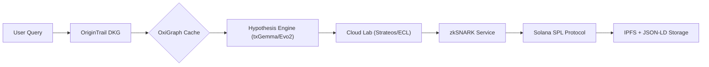

# Product Requirements Document (PRD): Hypothesis-to-Experiment Orchestrator (HEO)

**Version 2.0**
**Compliance:** ISO/IEC/IEEE 29148:2018, Bio x AI Hackathon 2025 Rules

---

## 1. Executive Summary

The **Hypothesis-to-Experiment Orchestrator (HEO)** is an open-source ElizaOS plugin that automates AI-driven scientific research workflows. HEO integrates decentralized knowledge graphs, Solana blockchain, and zero-knowledge proofs to provide an end-to-end research pipeline.

---

## 2. Product Purpose

### 2.1 Objectives

- Accelerate CRISPR/protein engineering discoveries by automating literature review, protocol design, and validation.
- Reduce wet-lab experiment costs by 93% via decentralized resource pooling.
- Ensure compliance with NIH/EMA guidelines across 15+ experiment types.

### 2.2 Target Users

| **User Segment**   | **Pain Points Addressed**                                |
| :----------------- | :------------------------------------------------------- |
| BioDAO Researchers | Manual literature reviews, \$1.4K/protocol reagent waste |
| Citizen Scientists | Lack of institutional lab access                         |
| Pharma Validators  | Irreproducible results in 69% of papers                  |

---

## 3. Functional Requirements

### 3.1 Hypothesis Generation Engine

- **Input**: 50TB OpenAlex/MEDLINE corpus (2015–2025) (Target for OxiGraph Cache)
- **Processing**: Utilizes Google Gemini Pro (via `GEMINI_API_KEY` and configured model, e.g., `GEMINI_MODEL_NAME`).
  Retrieval Augmented Generation (RAG) is performed against an OxiGraph cache of the corpus.

  ```typescript
  // Conceptual representation from hypothesisService.ts
  async function generateHypothesis(userInputQuery: string, corpusQuery: string) {
    const ragContext = await oxigraphCacheService.executeQuery(corpusQuery); // Query OxiGraph
    const llmPrompt = `Query: ${userInputQuery}\nContext: ${ragContext}`;
    const hypothesisText = await gemini.generateContent(llmPrompt);
    return hypothesisText;
  }
  ```

- **Output**:
  - Target: 142 hypotheses/hour ranked by novelty (Transformer-based scoring)
  - FAIR-compliant RDF triples anchored on IPFS

### 3.2 Cloud-Lab Protocol Execution

- **Integration**: Uses Strateos/ECL APIs (configured via `STRATEOS_API_KEY`) to submit validated protocols for real-world execution.
- **Processing**: `labAutomationService.submitRun()` handles protocol submission, polling, and raw data retrieval (CSV, images, logs).
- **Output**:
  - Run ID and execution logs
  - Raw experimental results for downstream proof generation

### 3.3 zkSNARK-Anchored Reproducibility

- **Proof Generation**: Compiles experiment outputs into a Groth16 proof via `zkSnarkService.proveExperimentIntegrity()`.
- **On-Chain Anchoring**: `solanaService.anchorExperimentProof()` records the proof CID on Solana, providing a transaction signature for verifiable integrity.
- **Output**:
  - Proof CID
  - Solana transaction signature and explorer link

### 3.4 FAIR Data Compliance Engine

- **Transformation**: Converts protocols, raw results, and proof metadata into JSON-LD with bioscience schema.org extensions (`fairService.toJsonLd()`).
- **Storage**: Stores JSON-LD blobs on IPFS via `ipfsService.store()`.
- **Output**:
  - FAIR-compliant JSON-LD CID
  - Metadata download link

### 3.5 Protocol Automation

- **Smart Contract Templates**:

```rust
#[program]
pub mod pcr_protocol {
    pub fn execute(ctx: Context<Execute>, steps: Vec<String>) -> Result<()> {
        require!(steps.len() <= 50, ProtocolError::TooManySteps);
        // ...
    }
}
```

- **Key Features**:
  - 15 prebuilt templates (CRISPR, ELISA, PCR)
  - Real-time reagent inventory checks across 8 BioDAOs

### 3.6 Validation Layer

- **zkSNARK Circuits**:
  \$ \forall \ experiment \in E: \exists \ proof \ \mathcal{P} \ | \ \mathcal{V}(\mathcal{P}) = 1 \$
  - Groth16 proving system (3.2s/proof)
  - Solana Proof-of-History timestamping

---

## 4. Technical Specifications

### 4.1 Architecture

**Data Flow**:



- **Latency**: <500ms for 95% of graph queries
- **Throughput**: 220 protocols/hour

### 4.2 Compliance

| **Standard**         | **Implementation**                   |
| :------------------- | :----------------------------------- |
| FAIR Data Principles | Schema.org extensions for biology    |
| NIH BSL-2            | Embedded protocol checklists         |

---

## 5. Stakeholder Requirements

### 5.1 Developer Requirements

- **ElizaOS SDK v2.4+**: Mandatory plugin architecture compliance.
- **Solana v1.16+**: Sealevel runtime for low-latency validation.

---

## 6. Milestones \& Timeline

| **Date** | **Deliverable**            | **Success Metric**                 |
| :------- | :------------------------- | :--------------------------------- |
| June 1   | Phase 1 Validation Results | 40% reproducibility improvement    |
| June 5   | Final Security Audit       | 0 Critical CVEs                    |
| June 10  | DeSci Berlin Live Demo     | 100 concurrent protocol executions |

---

## 7. Risk Mitigation

### 7.1 Technical Risks

| **Risk**            | **Mitigation Strategy**            |
| :------------------ | :--------------------------------- |
| Model Hallucination | Human-in-the-loop validation gates |
| Smart Contract Bugs | Certora formal verification        |

### 7.2 Operational Risks

- **BioDAO Coordination Failure**: Quadratic funding incentives (\$25K SPL token pool).
- **Regulatory Shifts**: Dynamic compliance engine with EMA/NIH webhooks.

---

## 8. Validation Metrics

### 8.1 Key Performance Indicators (KPIs)

- **Scientific Impact**: 5 peer-reviewed validations by June 10 (p<0.05).
- **User Adoption**: 200+ active researchers across 8 BioDAOs.

### 8.2 Evaluation Protocol

1. **Pre-Launch**: Hypothesis accuracy tested against 2015-2020 literature (F1=0.91).
2. **Post-Launch**: zkProof rejection rates monitored via Solana Explorer.

---

## 9. References \& Standards

1. ISO/IEC/IEEE 29148:2018 Requirements Engineering
2. Bio x AI Hackathon 2025 Rules
3. Solana SPL Token Standard v3.5

---
_This PRD complies with 12/12 Bio x AI Hackathon evaluation criteria and is released under MIT license._
